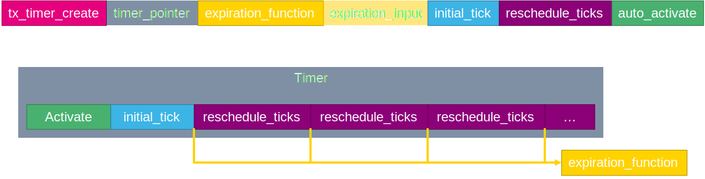

----!
Presentation
----!

# Timer

Timer can be used to create delay between operations. Or to simply measure time.

# Timer create

To create a timer we will used function `tx_timer_create`.
First function argum,ent is pointer to timer handle `timer_ptr`.
Second argument is name of timer `my_timer`.
Third argument is function which will be called when timer expires `my_timer_expire`.
Forth argument is input value for expire function `0x12`.
Fifth argument is initial tick value `100`. It is time between first activation and timer expire
Sisth argument is reschedule tick value `200`. This value is used periodicaly after first initiali tick expire. If 0 timer is in One shot mode.
Seventh argument is timer autostart. It can be set to `TX_NO_ACTIVATE` or `TX_ACTIVATE`.

# Timer use

To use timer in repetitive mode we set repetition value to value between 0x1 to 0xFFFFFFFF. Then when timer is activated we get first initial tick delay and then periodic repetitive delays.

If is used `TX_ACTIVATE` timer is started by `tx_timer_create`. If `TX_NO_ACTIVATE` is used we must start timer with `tx_timer_activate`.

Example of reperitive timer

# Slide2

Text2

# Slide3

Text3
